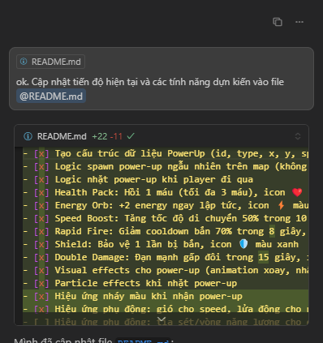
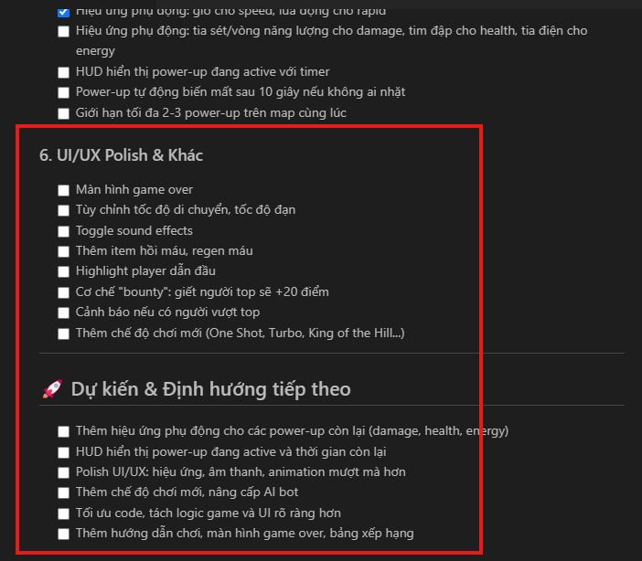

# Welcom ae, đọc để code ăn ý nhé

## Tạo nhánh
- Tạo branch mới từ dev, code xong merge vào dev thoải mái
- Merge vào main sẽ có CI/CD để deploy, check tại web `https://game.marc-nguyen.site/`

## Phối hợp cùng quản lý tiến độ
- Với tính năng mới. Liệt kê hết thành các bước nhỏ hơn vào file README.md
sau đó mới bắt đầu code
- Xong tính năng thì bảo AI cập nhật lại tiến độ vào file README, để người khác có thể vào code tiếp 

- Ví dụ: 
 

- Tương tự, nếu vào chưa biết code gì thì có thể check tiến độ ở file `README.md` . Rất nhiều task trống

- Tới cuối thấy file dài quá, thì bảo AI tách ra thành các file nhỏ hơn

- Các tính năng nhỏ như: 
  + nâng cấp hiệu ứng, cập nhật UI, nâng cấp bot
  + điều chỉnh thông số ( tăng speed, giảm fire rate,...) 
thì có thể tự thêm, tự làm.

- Tính năng lớn như thay đổi lối chơi thì cứ lên ý tưởng rồi bàn với mình trước nhé.
