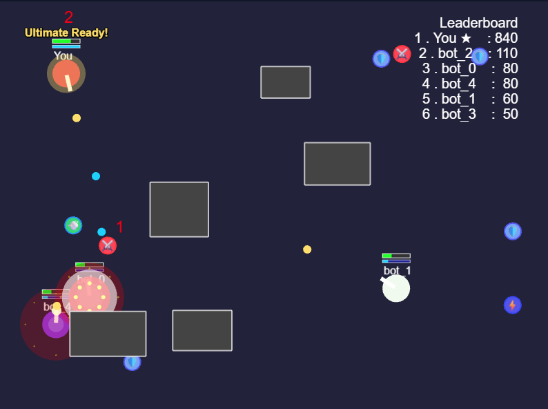

# 📊 Progress - Dot War Game 2D (Survival Mode)

## 🎮 Demo

https://github.com/user-attachments/assets/a1eefca3-7d09-42c7-bb92-2d2be65f0d65

---

## ✅ Checklist phát triển

### 1. Khởi tạo & Cơ bản

- [x] Scaffold React + Vite + Tailwind
- [x] Cài đặt Phaser 3
- [x] Tích hợp canvas game vào React (GameCanvas)

### 2. Gameplay Core

- [x] Player di chuyển bằng WASD
- [x] Bắn đạn bằng chuột
- [x] Đạn va chạm player (chết, respawn)
- [x] Giới hạn player trong màn chơi
- [x] Hiển thị nhiều bot (fake player), mỗi bot màu khác nhau
- [x] Bot di chuyển ngẫu nhiên, có thể bắn về phía player
- [x] Va chạm đạn ↔ player, bot chết sẽ respawn
- [x] Không thể tự bắn mình
- [x] Hiển thị tên, máu, điểm số
- [x] Hiển thị leaderboard điểm số
- [x] Vật cản (obstacle) random trên bản đồ, không thể đi/bắn xuyên qua

### 3. Nâng cao & Polish

- [x] Hiệu ứng đạn nổ, particle, flash, explosion
- [x] Hiệu ứng respawn (fade in/out, countdown)
- [x] Hiệu ứng di chuyển mượt mà hơn (trail effect cho đạn)
- [x] HUD hiển thị điểm số, high score
- [x] Menu pause/resume (ESC key)
- [x] Refactor code: tách logic game khỏi UI, chuẩn hóa code
- [x] Leaderboard realtime (local)
- [x] Bot có thể bắn đạn về phía player
- [x] Mỗi nhân vật có máu (HP), mặc định 3 điểm
- [x] Trúng đạn 3 lần sẽ chết (respawn lại từ đầu)
- [x] Hiển thị thanh máu trên đầu nhân vật
- [x] Cộng điểm khi bắn chết bot

### 4. Ultimate Skill (Tuyệt chiêu)

- [x] Thêm thanh năng lượng (energy bar) cho mỗi nhân vật, tối đa 5 điểm
- [x] Tiêu diệt 1 địch được +1 energy (không tăng khi tự sát hoặc đối thủ chết do nguyên nhân khác)
- [x] Đầy năng lượng (5/5) sẽ kích hoạt được ultimate: bắn liên tiếp 10 viên đạn theo hình quạt (spread shot ±45 độ quanh hướng chuột)
- [x] Khi đầy năng lượng, player có hiệu ứng nổi bật (viền sáng, nhấp nháy, hoặc glow). Có thể thêm popup nhỏ "Ultimate Ready!" trên đầu player
- [x] Đạn ultimate có hiệu ứng đặc biệt (màu khác, particle effect, tốc độ nhanh hơn)
- [x] Chết sẽ reset năng lượng về 0
- [x] Không thể tích lũy energy vượt quá 5
- [x] Chỉ dùng ultimate khi còn sống, không đang respawn
- [x] Không có cooldown cho ultimate (có thể dùng liên tục nếu đủ energy)
- [x] Ultimate chỉ bắn về hướng chuột, spread ±45 độ quanh hướng chuột
- [x] Âm thanh: Có hiệu ứng âm thanh khi kích hoạt ultimate

#### Hướng mở rộng về sau

- [ ] Ultimate có thể có cooldown (ví dụ: 5 giây sau khi dùng mới được dùng tiếp)
- [ ] Ultimate có thể gây hiệu ứng đặc biệt lên đối thủ (làm chậm, choáng, v.v.)
- [ ] Có thể nâng cấp ultimate (bắn nhiều viên hơn, damage cao hơn, hiệu ứng đẹp hơn)
- [ ] Thêm nhiều loại ultimate khác nhau cho từng nhân vật
- [ ] Thêm thông báo nổi bật khi player dùng ultimate thành công
- [ ] Bot có thể tự động dùng ultimate khi đủ energy
- [ ] Ultimate có thể phá vật cản hoặc xuyên qua nhiều đối thủ

### 5. Power-ups System

- [x] Tạo cấu trúc dữ liệu PowerUp (id, type, x, y, sprite, duration, value)
- [x] Logic spawn power-up ngẫu nhiên trên map (không trên obstacle)
- [x] Logic nhặt power-up khi player đi qua
- [x] Health Pack: Hồi 1 máu (tối đa 3 máu), icon ❤️ màu đỏ
- [x] Energy Orb: +2 energy ngay lập tức, icon ⚡ màu vàng
- [x] Speed Boost: Tăng tốc độ di chuyển 50% trong 10 giây, icon 💨 màu xanh
- [x] Rapid Fire: Giảm cooldown bắn 70% trong 8 giây, icon 🔥 màu cam
- [x] Shield: Bảo vệ 1 lần bị bắn, icon 🛡️ màu xanh
- [x] Double Damage: Đạn mạnh gấp đôi trong 15 giây, icon ⚔️ màu đỏ
- [x] Visual effects cho power-up (animation xoay, nhấp nháy)
- [x] Particle effects khi nhặt power-up
- [x] Hiệu ứng nháy màu khi nhận power-up
- [x] Hiệu ứng phụ động: gió cho speed, lửa động cho rapid
- [ ] Hiệu ứng phụ động: tia sét/vòng năng lượng cho damage, tim đập cho health, tia điện cho energy
- [ ] HUD hiển thị power-up đang active với timer
- [ ] Power-up tự động biến mất sau 10 giây nếu không ai nhặt
- [ ] Giới hạn tối đa 2-3 power-up trên map cùng lúc

### 6. 🎯 Survival Mode - Chế độ sinh tồn

#### 6.1 Core Survival Mechanics
- [x] Hệ thống thời gian sống sót (timer countdown)
- [ ] Wave system: mỗi wave tăng độ khó
- [x] Mục tiêu rõ ràng: "Sống sót X phút" hoặc "Vượt qua X wave"
- [x] Game over screen với thống kê (thời gian sống, điểm số, wave đạt được)
- [ ] High score system cho survival mode

#### 6.2 Progressive Difficulty
- [ ] Bot spawn nhiều hơn theo thời gian
- [ ] Bot di chuyển nhanh hơn ở wave cao
- [ ] Bot bắn nhanh hơn và chính xác hơn
- [ ] Bot có thể dùng ultimate skill ở wave cao
- [ ] Boss bot xuất hiện cuối mỗi 5 wave

#### 6.3 Survival Rewards & Progression
- [ ] Combo system: bắn liên tiếp được bonus điểm
- [ ] Streak bonus: sống sót càng lâu càng nhiều điểm
- [ ] Survival milestones: đạt 1 phút, 2 phút, 5 phút...
- [ ] Unlock new abilities sau mỗi milestone
- [ ] Persistent upgrades giữa các game

#### 6.4 Enhanced AI & Gameplay
- [ ] Bot có thể thu thập power-up
- [ ] Bot có thể tạo thành nhóm tấn công
- [ ] Bot tránh đạn thông minh hơn
- [ ] Bot có thể dùng shield và ultimate
- [ ] Bot có thể heal khi HP thấp

#### 6.5 Dynamic Environment
- [ ] Map thay đổi theo thời gian (obstacle di chuyển)
- [ ] Khu vực nguy hiểm (lava, poison) xuất hiện
- [ ] Safe zones tạm thời
- [ ] Teleport points
- [ ] Environmental hazards

#### 6.6 UI/UX Polish
- [ ] HUD hiển thị thời gian sống sót, wave hiện tại
- [ ] HUD hiển thị power-up đang active và thời gian còn lại
- [ ] Màn hình hướng dẫn phím điều khiển (WASD, Q để ulti)
- [ ] Hiệu ứng âm thanh và visual feedback
- [ ] Toggle sound effects
- [ ] Tùy chỉnh tốc độ di chuyển, tốc độ đạn
- [ ] Polish UI/UX: hiệu ứng, âm thanh, animation mượt mà hơn

#### 6.7 Code Optimization
- [ ] Tối ưu code, tách logic game và UI rõ ràng hơn
- [ ] Refactor game state management
- [ ] Implement proper game modes system
- [ ] Add configuration system cho difficulty
- [ ] Performance optimization cho nhiều bot
